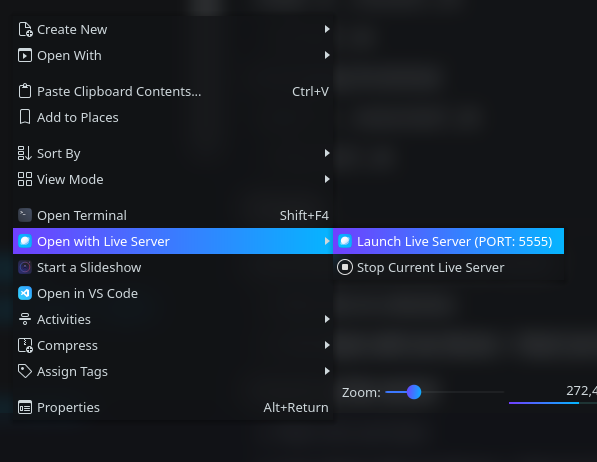

# Open with Live Server for Dolphin Service Menu

## Description
This script opens selected directory on **http://127.0.0.1:5555/** with your default web browser.

## Installing
On terminal:

`chmod +x ./install.sh`

`./install.sh`

## Uninstalling
On terminal:

`chmod +x ./uninstall.sh`

`./uninstall.sh`

## Usage
### Launching a directory as live server
1. Right click on a directory
2. Select **Open with Live Server** >> **Start Live Server (PORT: 5555)**

### Stopping a live server
1. Right click and folder
2. Select **Open with Live Server** >> **Stop Live Server**

OR

1. Open terminal
2. type `kill go-live-server` and [ENTER]

## Important!
After started a live server, you can't open other directory with live server. As needed you have to stop current live server from service menu (context menu). And re-click **Start Live Server (PORT: 5555)**